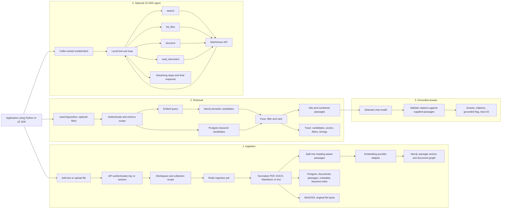
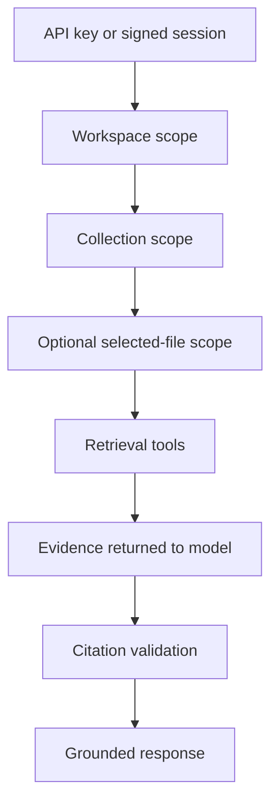

# How MarkVector works

MarkVector turns files and text into a searchable, traceable knowledge store,
then gives an AI model a constrained way to retrieve and answer from it. The
storage and retrieval contract does not depend on one chat model.

## End-to-end flow



## Where model agnosticism lives

### Server-side embeddings and answering

Every server-side model call goes through `packages/core/llm.py`. It asks
`packages/adapter` to resolve a provider into the same small configuration:

- base URL;
- API key;
- embedding model; and
- whether the provider accepts an explicit dimensions parameter.

`LLM_PROVIDER` currently selects `openai`, `nebius`, or `openrouter`.
`OPENAI_BASE_URL` can also point at another OpenAI-compatible endpoint. The
rest of ingestion, retrieval, answering, citations, and tracing does not know
which provider was selected.

```text
LLM_PROVIDER + provider environment variables
                    |
                    v
          resolve_provider()
                    |
                    v
         one OpenAI-compatible client
              /              \
       embeddings           chat/tools
```

The server uses `EMBEDDING_MODEL` while indexing documents and queries, and
`CHAT_MODEL` for written answers and tool-using navigation. Changing the chat
model does not require re-indexing. Changing the embedding model does: stored
document vectors and query vectors must use the same embedding space.

### JavaScript SDK agent

The JavaScript agent loop runs in the SDK consumer's process, not inside the
MarkVector API. The caller can provide:

- an existing client implementing the small `AgentClient` interface;
- `apiKey`, `baseUrl`, and `model` for an OpenAI-compatible endpoint; or
- the optional `openai` package with its normal environment configuration.

The model decides which read-only tool to call. MarkVector remains the source
of truth: tools search or open the collection and return evidence to the
model. `instructions` appends custom guidance to the protected grounding
prompt; `system` is available for a full prompt replacement.

File selection is enforced in the tool dispatcher, not only mentioned in the
prompt. When `files` is supplied, search, listing, structure inspection, and
document reads cannot widen beyond those IDs. Omitting `files` makes the whole
collection available.

## Search and answer modes

### Hybrid search

Hybrid search embeds the question, retrieves semantic passage candidates from
Neo4j, retrieves keyword candidates from PostgreSQL, then fuses and filters
them. It handles paraphrases alongside exact identifiers and proper nouns. If
the semantic provider is unavailable, keyword search can still return results
and the trace reports the degraded semantic arm.

### Vectorless answer (default)

Vectorless answering shows the model document heading trees. The model calls
`read_section` until it has enough evidence and then submits an answer. This
is often more precise for long structured documents because their headings
already describe where the answer lives.

### Hybrid answer

Hybrid answering runs hybrid retrieval first, sends the best numbered passages
to the chat model, and requires citations such as `[1]` and `[2]`. MarkVector
removes citation numbers that do not resolve to passages actually supplied to
the model.

Both answer modes return:

- answer text;
- numbered citation objects with document, heading, passage, and score;
- `grounded`, distinguishing an answer from a refusal;
- `degraded`, when part of retrieval or generation was unavailable; and
- `trace_id`, linking the response to its retrieval derivation.

## Trust boundaries



The model is never the authority for tenancy, collection access, selected-file
scope, or whether a citation exists. Those controls remain deterministic.

## Current portability boundary

MarkVector is provider-agnostic inside an **OpenAI-compatible API contract**;
it is not yet protocol-agnostic. A native Anthropic or Gemini client needs a
small adapter exposing the same chat and tool-call surface. Embeddings are
currently fixed at 1,536 dimensions, so a provider must return that size or
support dimension reduction. The Python SDK currently exposes ingestion,
search, server-side answering, and traces; the caller-owned tool agent is in
the JavaScript SDK.

